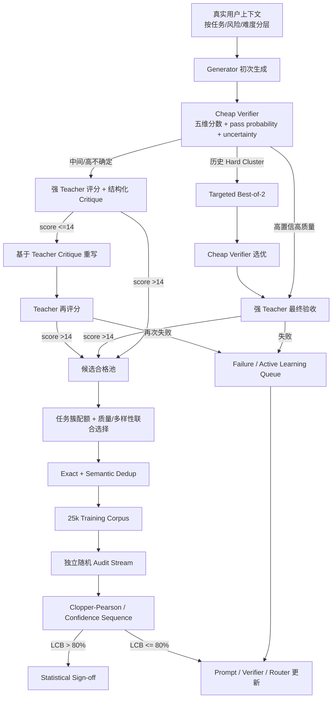

# 面向垂直领域的高质量 LLM 合成数据生产：从教师筛选到可统计认证的自适应生产体系

## 执行摘要

基于公开论文、开源实现与工业技术报告，当前方案——“真实用户上下文 → 生成 Markdown 回答 → 强教师多维评分 → 低分样本复核/重写 → 再评分 → `score > 14/20` 入库”——方向是合理的，而且与近年来工业界采用的 **rejection sampling、reward-model filtering、critique-and-revise、test-time scaling** 路线高度一致。Meta 的 Llama 3 后训练流程明确使用 reward model 对生成数据做 rejection sampling；OpenAI 的过程监督工作表明 verifier/reward model 可显著改善候选选择；Self-Refine 则证明了迭代反馈—修订在多种生成任务中平均可带来约 20 个百分点的绝对改进。citeturn14search2turn14search0turn13search3

但对你的目标，最重要的结论不是“再加一个搜索算法”，而是将系统从**单一阈值过滤器**升级为四层闭环：

> **生成质量层 → 廉价 verifier/路由层 → 强教师校准与验收层 → 独立统计认证层。**

原因是，这四层解决的是不同问题。Best-of-N、verifier-guided generation、critique-and-revise 能提高真实通过概率；router、active learning 和学生 verifier 能减少昂贵教师调用；cluster-aware generation 与语义去重能避免高分数据逐渐同质化；只有 Clopper–Pearson、序贯检验或 confidence sequence 一类统计程序，才能把“我观察到约 90%”转化成“在给定置信水平下可以声称总体通过率高于 80%”。citeturn19search3turn20academia28

**当前 11/12 的实验远不足以证明稳定超过 80%。** 11/12 的点估计虽然是 91.7%，但按单侧 95% Clopper–Pearson 精确区间计算，总体通过率下界只有约 **66.1%**；即使 12/12 全通过，下界也只有约 **77.9%**。至少要达到 14/14，全通过时单侧 95% 下界才约为 **80.74%**。这并不意味着 14 条就足以做严肃生产认证，因为真实上下文通常存在任务、长度、风险等级和领域子类异质性；它只是说明“小样本高通过率”的证据强度远低于点估计给人的直觉。精确二项区间的构造可参考 NIST。citeturn19search3

对于你的场景，我建议把“80%”重新定义为：

\[
p_{\mathrm{final}}
=
P(\text{在预先规定的最大生成预算内最终得到 score}>14
\mid X\sim \mathcal D_{\mathrm{production}})
\]

其中 pipeline、judge 版本、prompt、最大重试次数均固定。这样才不会出现“最终合格集本来就只保留 `>14`，所以通过率自然是 100%”这一统计上的循环定义。建议同时追踪：

\[
q_1=P(\text{first-pass}>14)
\]

以及

\[
r=P(\text{rewrite-pass}>14\mid\text{first-pass}\le14),
\]

于是单次重写情况下有

\[
p_{\mathrm{final}}=q_1+(1-q_1)r.
\]

**不建议把工程目标设为刚好 80%。** 为使 95% 单侧置信下界稳定越过 80%，实际 pipeline 最好做到约 **88%–90%** 的点通过率。精确二项功效计算表明：若真实通过率只有 85%，为了以单侧 \(\alpha=0.05\)、约 80% power 证明 \(p>0.8\)，约需 **365 个独立审计样本**；若真实通过率是 88%，约需 **135**；若达到 90%，约需 **82**。因此，把工程通过率从 82–85% 推到 88–90%，不仅提升产能，也显著降低认证成本。citeturn19search3

综合证据后，我对各技术的优先级判断是：

**第一优先级：** teacher-grounded critique-and-revise、judge 校准、自动 prompt 优化、cheap verifier + targeted Best-of-2、分层质量监控、语义去重/cluster quota、Clopper–Pearson 或 confidence sequence。

**第二优先级：** active learning、difficulty-aware routing、基于 verifier 不确定性的动态预算分配。

**第三优先级：** Tree-of-Thought/MCTS 式深搜索。它在可验证的数学、代码、规划任务上非常有价值，但不应默认用于一般 Markdown 垂域问答；其候选树成本可能迅速增长，而 verifier error/reward hacking 还可能随着搜索宽度增加而被放大。ToT 在 Game of 24 上确实把 GPT-4 CoT 的 4% 提升到 74%，但这个结果不能直接外推到一般垂域内容生成。citeturn13search2turn14search6

下表使用四类贡献标记：

**① 单条质量　② 评估/教师成本　③ 数据多样性　④ 统计保证**
`◎` 强贡献；`○` 中等；`△` 间接/条件性；`—` 基本无直接贡献。

| 技术 | ① | ② | ③ | ④ | 对你的总体判断 |
|---|---:|---:|---:|---:|---|
| Verifier / reward-model guided generation | ◎ | ◎ | △ | — | **强烈推荐**；尤其适合作为 cheap student verifier + 强教师最终验收 |
| Rejection sampling | ◎ | △ | △/负 | — | **推荐**；但应 targeted，而非所有样本 N 倍生成 |
| Best-of-N | ◎ | △/负 | ○ | — | **推荐 Best-of-2/4 给困难样本** |
| Tree search / MCTS / ToT | ◎ | — | ○ | — | **只对强可验证/强推理任务使用** |
| Critique-and-revise | ◎ | ○ | — | — | **当前流程最值得强化的部分** |
| Test-time scaling | ◎ | ◎ | △ | — | **推荐 difficulty-adaptive，而非 uniform N** |
| Dynamic routing / MAB | ○ | ◎ | △ | — | **规模化后高 ROI** |
| Active learning | ○ | ◎ | ○ | — | **推荐用于 verifier/judge/router 的数据闭环** |
| 自动提示词优化 | ◎ | ◎ | △ | — | **低风险、高 ROI，先做** |
| LLM-as-a-judge 校准 | ◎* | ◎ | — | △ | **生产必做；否则阈值本身不可靠** |
| 质量—多样性联合选择 | ○ | △ | ◎ | — | **25k 数据集必做** |
| 去重/模式坍缩控制 | △ | △ | ◎ | — | **必做；避免“高分但重复”** |
| CI / 序贯检验 / confidence sequence | — | ○ | — | ◎ | **唯一直接回答“是否稳定 ≥80%”的方法** |

\* Judge calibration 不直接改变原始答案，但通过更可靠的反馈、重写和筛选间接提高最终样本质量。

## 评价框架与当前证据

### 首先要修正通过率的定义

你目前说“25,000 条最终合格数据中得分 >14 的稳定通过率达到 ≥80%”，从数据工程定义看存在一个需要显式化的问题：**若“最终合格”本身就定义为 `score > 14`，那么合格集合内部的 `score > 14` 比率按定义是 100%。**

因此生产 KPI 应放在**进入过滤器之前的上下文流**上：

> 从目标真实用户上下文分布随机抽取一个上下文，在固定的模型、prompt、judge、最大重试预算下，最终能否产生至少一个 `score > 14` 的答案。

随后分开报告：

| KPI | 定义 | 用途 |
|---|---|---|
| First-pass pass rate \(q_1\) | 第一次生成直接 >14 | 衡量 generator/prompt 本身 |
| Rescue rate \(r\) | 初次失败后修订成功比例 | 衡量 critique/revise |
| Final pass rate \(p_f\) | 在规定预算内最终成功 | 决定 25k 生产效率 |
| Teacher calls / accepted | 每条合格数据所需教师次数 | 核心成本指标 |
| Generator tokens / accepted | 每条合格数据生成 token | 核心计算成本指标 |
| Human-audited true pass | 专家复核后真实合格率 | 校准 judge |
| Diversity / cluster coverage | 各语义簇、任务簇覆盖度 | 防止过滤诱发模式坍缩 |

你的五项评分——事实一致性、数值与单位、个性化、结构、安全性——也不建议只压缩成一个总分。LLM judge 已知存在 position bias、verbosity bias、self-enhancement bias 等系统性偏差；强 judge 在 MT-Bench/Arena 上可以达到超过 80% 的人类偏好一致度，但这个数字并不意味着在你的五维垂域 rubric 上也自动达到同样可靠性。G-Eval 的 GPT-4 evaluator 在摘要任务上与人类评分的 Spearman 相关系数为 0.514，同时作者也指出 evaluator 可能偏好 LLM 生成文本。citeturn17search0turn17search1

因此更合理的验收逻辑是类似：

\[
\text{accept} =
(\text{total}>14)
\land
(\text{factual}\ge t_f)
\land
(\text{numeric}\ge t_n)
\land
(\text{safety}\ge t_s)
\land
\neg \text{fatal error}
\]

而不是允许“结构很好、语言很长”去补偿一个严重的事实或单位错误。这是基于 judge 偏差研究和你的业务目标做出的工程推论。citeturn17search0turn17search4

### 当前十二条样本到底说明了什么

把每个真实上下文的**最终结果**视为一次 Bernoulli 成功/失败，11/12 给出：

\[
\hat p = \frac{11}{12}=91.67\%.
\]

但使用单侧 95% Clopper–Pearson 精确置信区间，其下界约为：

\[
L_{95\%}\approx 66.13\%.
\]

所以目前可严谨表达为：

> “在 12 条初步实验中观察到 11/12 的最终通过率，但样本量不足；在独立同分布和 pipeline 固定的假设下，单侧 95% 精确下置信界约为 66%，尚不能支持总体通过率高于 80% 的结论。”

Clopper–Pearson 区间通过反演精确二项检验构造，不依赖大样本正态近似。citeturn19search3

几个很有用的参考点是：

| 观察结果 | 点通过率 | 单侧 95% CP 下界 | 是否可声明 \(p>0.80\) |
|---:|---:|---:|---|
| 11/12 | 91.67% | 66.13% | 否 |
| 12/12 | 100% | 77.91% | 否 |
| 14/14 | 100% | 80.74% | 是，但样本覆盖极弱 |
| 45/50 | 90.00% | 80.12% | 刚刚可以 |
| 90/100 | 90.00% | 83.63% | 可以 |
| 170/200 | 85.00% | 80.21% | 可以 |
| 340/400 | 85.00% | 81.75% | 更稳健 |
| 425/500 | 85.00% | 82.12% | 更适合分层审计 |

以上数值按 NIST 给出的 exact-binomial/Clopper–Pearson 构造计算。citeturn19search3

更重要的是，50 个样本得到 45 个通过虽然数学上已经刚好使总体下界超过 0.8，但在真实垂域数据中，50 条可能根本没有覆盖长上下文、稀有任务、高风险事实、复杂单位换算、不同个性化模式等。因此生产 sign-off 建议不是“最小数学样本量”，而是 **300–500 条分层独立 audit** 起步；如果需要对子领域分别做质量保证，则应为关键 slice 单独规划样本。

### 为什么目标应瞄准百分之八十八到九十

若真实 \(p\) 很接近 0.80，则“证明它大于 0.80”本来就是一个低信噪比统计问题。

对单侧精确二项检验 \(H_0:p\le0.80\)，\(\alpha=0.05\)，约 80% power 的计算为：

| 真实 \(p\) | 大致所需 audit 样本 |
|---:|---:|
| 0.83 | 1,043 |
| 0.85 | 365 |
| 0.88 | 135 |
| 0.90 | 82 |

因此最划算的策略往往不是花大量审计样本证明一个 82% 的 pipeline，而是先通过 prompt/verifier/revision 把实际通过率推至 **88–90%**，再做认证。精确二项方法本身可依据 NIST 的二项检验/置信区间构造。citeturn19search3

如果生产过程中希望“每生产 100 或 200 条就看一次，一旦证据够了就停止”，则不能反复查看普通固定样本 CI 后任选时间停止，因为会产生 optional-stopping 问题。Howard、Ramdas 等人的 **confidence sequence** 提供在任意数据依赖停止时间仍保持覆盖率的 time-uniform 区间，正适合持续生产质量监控。citeturn20academia28turn20academia27

## 技术路线逐项评估与对比

下面的成本均采用归一化记号，因为模型可替换、API 价格未指定：

- \(G\)：一次完整 generator 调用；
- \(J\)：一次当前强 teacher/judge 调用；
- \(V\)：一次便宜 verifier 调用；
- 当前初次失败比例 \(f=1-q_1\)。

如果一次失败样本只做一次“复核+重写”并再评，则你当前系统的期望成本约为：

\[
C_{\mathrm{current}}
=(G+J)+f(G+J)
=(1+f)(G+J).
\]

若复核和重写拆成两次 generator 调用，则再额外加 \(fG\)。

### 方法级总表

| 方法 | 核心思路 / 适用条件 | 实现重点 | 额外 token/API 成本 | 真实实验或工业证据 | 对 ≥80% 的帮助 | 关键消融/风险 | 开源 |
|---|---|---|---|---|---|---|---|
| **Verifier / Reward Model guided** ①◎②◎③△④— | 用便宜模型预测回答质量、正确性或逐步正确性；最适合有重复生产和可积累 teacher labels 的场景 | 将五维 teacher 分数保留为 multi-task label；同时预测 pass probability 与 uncertainty；只把边界样本交强教师 | 训练后约 `1G + V` 做预筛；若所有候选仍需终审则另 `+J`。通常 \(V\ll J\) | OpenAI PRM 在 MATH representative subset 上解决 78%；PRM800K 含 80 万 step labels，论文报告 active learning 可提高监督效率。OmegaPRM 自动过程监督把 Gemini Pro MATH500 从 51% 提至 69.4%、GSM8K 从 86.4% 至 93.6%。citeturn14search0turn14academia23 | **高潜力，但非保证。** 可让更多困难候选被正确识别并减少 J 调用；开放式 Markdown 的 transfer 风险高于数学 | PRM 通常优于只看最终结果的 ORM，但 verifier OOD 与 reward hacking 是核心风险；大 N 时 reward hacking 可能加重。citeturn14search6 | [PRM800K](https://github.com/openai/prm800k)；[ThinkPRM](https://github.com/mukhal/thinkprm) |
| **Rejection sampling** ①◎②△③△④— | 一个上下文生成多个候选，再按 RM/judge 丢弃低分候选 | 不应全量 N=4/8；先识别 hard bucket，再增加候选 | N 个候选约 `NG + NV + J_final`；若 J 给每个候选评分则成本变 `NG + NJ` | Llama 3 将 reward model 用于 human annotation prompts 的 rejection sampling；Llama 2 后训练也采用多候选 reward ranking/rejection-sampling fine-tuning。citeturn14search2turn9search0 | **高**，前提是单次 pass<80 且候选错误并非高度相关 | N 越大并非无条件越好；verifier 噪声会导致“从更多样本中挑出最会骗 verifier 的答案” | Llama 系列公开技术报告；可自行基于 vLLM/sglang 实现 |
| **Best-of-N** ①◎②△/负③○④— | 并行采 N 个独立候选，由 verifier 选最优 | 推荐 N=2 起步，证明 marginal gain 后才上 4；改变 temperature/seed 促使候选真正多样 | Best-of-2≈2G；Best-of-4≈4G，再加选择成本 | PRM 工作显示 process-supervised verifier 在 Best-of-N 下优于 outcome verifier；Snell 等发现单一 BoN 并非所有难度上的 compute-optimal 方案。citeturn0search3turn13search1 | **高**，是最容易把 70–80% 拉上去的手段之一，但应 targeted | 候选相关性高会让 N 的边际收益快速衰减 | 可用 PRM/Prometheus/自训 verifier 组合 |
| **Tree search / ToT / MCTS** ①◎②—③○④— | 在中间步骤分叉、评估、剪枝、回溯；适合数学、代码、规划和工具任务 | 必须有中间状态和可靠 verifier；一般文章生成不宜机械树搜索 | 分支 \(b\)、深度 \(d\) 未剪枝时节点可达 \(1+b+\cdots+b^d\)，明显高于 BoN | ToT 的 Game of 24：GPT-4 CoT 4%，ToT 74%；OmegaPRM 也用 MCTS 自动构造过程监督。citeturn13search2turn14academia23 | **对特定 slice 高，对一般数据中等/低** | ToT 的巨大增益来自高度结构化任务，不能外推为通用 Markdown 74% 增益 | [Tree of Thoughts](https://github.com/princeton-nlp/tree-of-thought-llm) |
| **Critique-and-revise** ①◎②○③—④— | 对初稿诊断，再针对错误重写；与你当前方法最接近 | **最好把 teacher 的维度级失败原因直接馈给 rewriter**，而不是纯 intrinsic self-reflection | 只处理失败样本时平均额外约 `f(G+J)`；成本非常适合自适应生产 | Self-Refine 在 7 类任务上平均约 +20pp absolute；无需额外训练。citeturn13search3 | **很高**，且与你已有 pipeline 摩擦最小 | 纯 intrinsic self-correction 并不稳定；已有工作发现无外部反馈时推理自纠可能无效甚至变差。citeturn8search0turn8search3 | [Self-Refine](https://github.com/madaan/self-refine) |
| **Test-time scaling** ①◎②◎③△④— | 按 prompt 难度动态分配更多 sampling/revision/search compute | 难题多算、易题一次完成；router 输入应包括上下文类型、长度、首轮 verifier score、uncertainty | 从 1G 到 NG 动态变化；关键是避免 uniform N | Snell 等的 compute-optimal allocation 相比普通 Best-of-N 将 test-time compute efficiency 提升 **超过 4×**；部分任务中小模型加测试时计算可超越 14× 参数规模的模型。citeturn13search1 | **高**，尤其在预算固定时 | 最优 scaling policy 与 prompt 难度强相关，不能设统一 N | 论文实现思路可复刻；结合自己的 verifier/router 最实用 |
| **动态路由 / cascade / MAB** ①○②◎③△④— | easy → 便宜路径；hard/uncertain → 强模型、多候选或重写 | 初期用监督 router；数据积累后再考虑 contextual bandit；永远保留随机探索/审计流 | router 本身远小于一次 LLM call；能显著减少 J/强 G 占比 | RouteLLM 在公开 benchmark 中报告 >2× cost saving 且质量影响较小；官方 repo 提供训练 router。FrugalGPT 在特定任务上可匹配最佳 LLM 且最高节省 98% 成本，或同成本 +4% accuracy。citeturn18search1turn18search0 | **间接高**：它让你能把节省的预算重新投给真正困难的 10–30% 样本 | FrugalGPT 的 98% 是特定数据集极值，不应作为你的预算预期；bandit 在 distribution shift 下需探索 | [RouteLLM](https://github.com/lm-sys/RouteLLM) |
| **Contextual multi-armed bandit** ①○②◎③△④— | 把生成路径/模型选择当 context-dependent action，根据质量−成本反馈持续学习 | reward 应包含通过、成本、稀有 slice coverage；安全/事实高风险任务应设置硬约束而不是纯 reward | 需要少量探索流量；稳态可降低强模型比例 | BaRP 将路由构造成 multi-objective contextual bandit，从实际选中模型的 bandit feedback 学习；这是较新的方向，工业成熟度低于 RouteLLM。citeturn18search7 | **中等；不建议作为第一阶段关键依赖** | non-stationarity、exploration risk、reward misspecification | 论文实现为主；成熟度低于 RouteLLM |
| **Active learning** ①○②◎③○④— | 把昂贵标注集中到 uncertainty、disagreement、稀有 cluster 和失败样本 | 优先 teacher/human 标：verifier 不确定、judge 不一致、11–15 分边界、罕见 task | 不需要全量多判；候选池需少量重复采样估 uncertainty | Active-Prompt 基于多次生成的不确定性挑选需人工标注的 exemplars，在 8 个复杂 reasoning tasks 上优于竞争 baseline；OpenAI PRM 也报告 active learning 提升监督效率。citeturn19search2turn14search0 | **中高**，主要通过更快改善 verifier/prompt，而非即时改变每条答案 | 开放式生成的 uncertainty 比离散 QA 更难定义；不能简单照搬 answer entropy | [Active-Prompt](https://github.com/shizhediao/active-prompt) |
| **自动 Prompt 优化** ①◎②◎③△④— | 直接优化 generator、critic、judge 三类 prompt，而不是靠人工局部修改 | train/dev/audit 三分；objective 用 pass rate + 各维失败率 + 成本 + diversity penalty | **offline 成本**；上线后基本零额外 call，通常是 ROI 最高的方法之一 | OPRO 最优提示词比人工 prompt 在 GSM8K 最高 +8%、BBH 最高 +50%；MIPRO 在 Llama-3-8B 的多阶段程序中 5/7 优于 baseline，最高 +13% accuracy。citeturn19academia23turn19search1 | **高**，但必须在未见过的 context holdout 验证 | 容易 overfit judge 或 benchmark；不能直接优化同一批 teacher scores 再在同一批报结果 | [OPRO](https://github.com/google-deepmind/opro)；[DSPy/MIPRO](https://dspy.ai/) |
| **LLM-as-a-judge 校准** ①○②○③—④△ | 让 `score >14` 真正对应人工认为的高质量 | 人工 gold set；多维 rubric；固定 judge 版本；边界双判；事实/数值加 deterministic checks；监测 generator/judge family bias | 推荐只对边界 10–20% 加第二 judge，而非双判全部；另加小比例人工 audit | GPT-4 类强 judge 在 MT-Bench/Arena 上 >80% human agreement，但有位置、verbosity、自偏好问题；Prometheus 2 在其评测的 open evaluator 中与 human/proprietary judge 的一致性最佳，支持自定义 rubric 和 pointwise/pairwise。citeturn17search0turn17search2 | **生产必需，但不是直接提高 p 的魔法**；未校准 judge 时“80%”本身意义不稳 | judge 漂移、自增强偏差、长度偏差；相同厂商/家族 generator 和 judge 应专门做 bias audit | [FastChat LLM Judge](https://github.com/lm-sys/FastChat/tree/main/fastchat/llm_judge)；[Prometheus Eval](https://github.com/prometheus-eval/prometheus-eval)；[G-Eval](https://github.com/nlpyang/geval) |
| **质量—多样性联合选择** ①○②△③◎④— | 不仅按 score 排序，还在语义/任务簇内做 ranking、quota、coverage | cluster 后按簇保留 top-k，而非全局只保最高分；对 rare/hard slice 保底 | embedding/clustering 为主要额外成本，通常远低于生成 API | CaR 通过 clustering + ranking 保留多样性，仅选 Alpaca 1.96% 数据，训练模型在 GPT-4 evaluation 上平均超过 Alpaca 32.1%，且论文报告成本约为既有方法的 11.2%。citeturn15search2 | **对稳定 80% 间接；对最终训练价值非常高** | 单一全局分数通常偏向“容易、规范、类似”的答案 | 可参考 CaR、LESS；[LESS](https://github.com/princeton-nlp/LESS) |
| **去重 / 模式坍缩控制** ①△②△③◎④— | exact + near + semantic dedup；限制 cluster dominance | 在 accepted pool 后做 exact hash → lexical near-dedup → embedding semantic dedup；被去重的稀有高质量样本不应机械删除 | 基本无生成 token；需要 embedding/ANN | SemDeDup 表明可去掉约 50% 的语义冗余数据而性能损失很小，并提高 OOD 表现、近似减半训练时间。citeturn15academia25 | **对通过率无直接作用；对 25k 的有效信息量至关重要** | 过度去重会误删必要重复；synthetic recursion 的尾部分布丢失是已观察风险 | [SemDeDup](https://github.com/facebookresearch/SemDeDup) |
| **序贯检验 / CI / Confidence Sequence** ①—②○③—④◎ | 独立 audit 流持续估计 p，并在统计证据足够时停止/告警 | 固定样本用单侧 exact CI；持续监控用 CS；pipeline 版本变化必须分开 | 只增加 audit；若 teacher score 已记录，统计本身几乎无 token 成本，但 judge fidelity 仍需独立人工 audit | Clopper–Pearson 提供 exact binomial CI；confidence sequence 在任意 stopping time 仍有效。citeturn19search3turn20academia28 | **唯一可直接“保证/认证 ≥80%”的技术** | 前提是 audit sample 对目标生产分布有代表性；judge 错误不能由统计方法自动消失 | 标准统计包可直接实现 |

### Verifier 与 reward model：最值得新增的一层

对你的场景，不建议一开始训练复杂的 step-level PRM；一般 Markdown 回答没有天然“数学推导步骤”。更可迁移的设计是训练一个 **response-level multidimensional verifier**：

\[
V(x,y)\rightarrow
(\hat s_{\mathrm{fact}},
\hat s_{\mathrm{num}},
\hat s_{\mathrm{pers}},
\hat s_{\mathrm{struct}},
\hat s_{\mathrm{safety}},
\hat p_{\mathrm{pass}},
u)
\]

其中 \(u\) 表示不确定度。

你的 teacher 评分本身已经天然产生训练 verifier 所需的 label。建议**不要只保存 total score**，而应保存所有维度、教师 critique、是否重写、重写前后分数、model/prompt/judge version。这样后续可以同时训练：

1. `pass/fail classifier`；
2. 20 分 ordinal/regression scorer；
3. 五个 dimension heads；
4. uncertainty/disagreement estimator。

OpenAI 的过程监督工作说明细粒度 reward supervision 可以比仅判断最终结果提供更强的候选选择信号；PRM800K 本身公开了 80 万 step-level labels。ThinkPRM 又说明 verifier 并非必须依赖极大人工标注量：其工作报告仅使用 PRM800K 约 1% 的 process labels 也能在多项 verifier benchmark 上超过若干判别式基线。citeturn14search0turn14academia22

不过必须注意 **Goodhart/reward hacking**。近期 PRM 实验显示，Best-of-N 从小 N 增至很大 N 时收益可能趋缓，弱 reward model 甚至会被更强 generator“利用”；因此 verifier 应首先作为**预筛/路由器**，强 teacher 仍是最终 acceptance oracle，至少在早期阶段如此。citeturn14search6

### Rejection sampling、Best-of-N 与树搜索应该如何分工

三者不应视为同一件事。

**Rejection sampling** 是生成若干样本再剔除不合格者；**Best-of-N** 通常从 N 个候选中保留评分最高者；**tree search** 则在生成中途评估并扩展部分路径。Meta Llama 3 的训练流程明确使用 reward model 对 human annotation prompts 做 rejection sampling，因此该路线具有直接工业先例。citeturn14search2

你最应该先测的是 **targeted Best-of-2**，而不是全量 Best-of-4：

```text
一次生成
  ↓
cheap verifier
  ├── 高置信高质量 → teacher final judge
  ├── 中间/不确定 → teacher judge → critique/rewrite
  └── hard / historically low-pass cluster
           ↓
       再生成 1 个候选
           ↓
      verifier 选优
           ↓
       teacher final judge
```

Best-of-N 的经济性高度取决于**候选错误相关性**。若单次候选通过概率为 \(q\)，且候选完全独立，则至少一个合格候选的理论概率是

\[
1-(1-q)^N.
\]

例如 \(q=0.7\) 时，N=2 的 oracle upper bound 是 91%；但真实候选显然并不独立，而且 verifier 也不是 oracle，所以实际收益一定明显低于这个上界。这个公式最适合用来提醒团队：**N 的价值来自错误多样性，而不是简单重复调用同一个 prompt。**

因此 Best-of-N 应同步做 temperature、prompt wording、reasoning style 或 model-family diversity 的消融。

Tree-of-Thought 在需要探索和回溯的问题上有非常强的实验证据：Game of 24 中 GPT-4 CoT 只有 4% success，而 ToT 达到 74%。但你的普遍 Markdown 生成通常没有自然的状态转移或中间正确性 oracle，因此建议把 ToT/MCTS 限制到类似“复杂计算、多约束规划、代码、可工具验证推理”的 slice。citeturn13search2

### Self-reflection 应升级为 teacher-grounded revision

你的“低分样本自我复核与重写”与 Self-Refine 高度接近。Self-Refine 采用：

\[
\text{Generate}\rightarrow
\text{Feedback}\rightarrow
\text{Refine}\rightarrow\cdots
\]

在七类任务上平均约有 20 个百分点绝对改进，而且不需要额外训练。citeturn13search3

但真正值得改变的是：**不要只让 generator 自己猜自己错在哪里。**

已有关于 intrinsic self-correction 的研究指出，在缺乏外部反馈时，让模型“再检查一下”并不能稳定改善推理，有时甚至会降低正确率。citeturn8search0turn8search3

因此推荐改成：

> `teacher score + dimension-level critique → generator rewrite`

例如 teacher 不仅返回：

```json
{"total": 12}
```

而是返回类似：

```json
{
  "total": 12,
  "factual": 2,
  "numeric_units": 1,
  "personalization": 3,
  "structure": 4,
  "safety": 2,
  "fatal_errors": [
    "将 2.5 mg 写成了 2.5 g"
  ],
  "revision_instructions": [
    "重新核对全部数量级与单位转换",
    "保持现有结构，不要扩写未提供的用户事实"
  ]
}
```

rewrite prompt 只允许修复被指出的问题，并要求保留已正确内容。这样 teacher 的第一次昂贵调用同时承担 **judge + critic** 两个角色，不必再额外调用一个 critique model。

### Test-time scaling 的关键是动态而不是“大家都多采样”

Snell 等人的结果非常适合你的生产问题：不同 difficulty 的 prompt 对额外 test-time compute 的收益差异很大；他们据此做 compute-optimal allocation，相较普通 Best-of-N 的测试时计算效率提高超过 4 倍。citeturn13search1

这意味着你的最佳政策很可能类似：

| Difficulty / uncertainty | 生产预算 |
|---|---|
| Easy | 1 generation |
| Normal | 1 generation + teacher |
| Borderline | 1 generation + critique/rewrite |
| Hard | Best-of-2 + verifier + teacher |
| Very hard / rare / high value | Best-of-4 或 domain-specific search |
| Repeated failure | 不再继续烧 token；进入 active-learning / prompt-debug queue |

而不是给 25,000 条全部生成四次。

### 动态路由和 Bandit：先监督路由，后在线学习

RouteLLM 是更成熟的起点：其框架用 preference data 学习把容易 query 送往便宜模型、难题送往强模型，在公开 benchmark 中论文报告超过 2× 的成本节省而保持相近质量；官方 repo 已开源。citeturn18search1turn18search2

FrugalGPT 的 cascade 进一步说明任务特定的级联可以产生非常大的成本收益，其实验中存在最高 98% 成本降低、或者同等成本下较 GPT-4 +4% accuracy 的结果；但这个 98% 是数据集与候选 API 组合相关的极端结果，不应拿来作为你的生产预算预测。citeturn18search0

在你的场景里，router action 不只是“选模型”，而可以是：

\[
a\in
\{
\text{one-shot},
\text{rewrite},
\text{BoN2},
\text{BoN4},
\text{strong-generator},
\text{human-review}
\}.
\]

当积累数千条真实 production outcomes 后，再把它升级为 contextual bandit。BaRP 等近期工作已经明确将 LLM routing 表述为兼顾 performance 和 cost 的 multi-objective contextual bandit，但这一方向整体仍比 RouteLLM 更新、工业验证更少。citeturn18search7

尤其对安全或严重事实错误，不应让 bandit 用较低价格“抵消”质量损失。应该定义硬约束：

\[
P(\text{critical safety/factual failure}\mid a,x)<\epsilon
\]

之后再在可行 action 中优化 cost。

### Active learning 最适合解决“该把昂贵教师花在哪里”

Active-Prompt 的思想高度可迁移：不是随机挑样本做人类标注，而是用多次生成的 disagreement/uncertainty 识别最值得标注的问题；论文在八个复杂 reasoning task 上报告优于竞争 baseline，并做了 uncertainty metric、pool size 等分析。citeturn19search2

你的 active-learning acquisition function 可以直接设为：

\[
A(x,y)
=
\lambda_1 U_V
+\lambda_2 |S_V-S_J|
+\lambda_3 I(11\le S_J\le15)
+\lambda_4 R_{\text{rare-cluster}}
+\lambda_5 R_{\text{high-risk}}.
\]

也就是说，优先把以下数据送给人工专家/最强教师：

**verifier 不确定；cheap verifier 与 teacher 冲突；刚好卡在阈值附近；稀有 cluster；事实、安全高风险。**

这比随机追加 5,000 条 teacher label 更有价值。OpenAI 的 PRM 工作也明确报告 active learning 提高了 process supervision 的效率。citeturn14search0

### 自动 Prompt 优化应早于复杂搜索算法

这是非常容易被低估的杠杆。OPRO 使用 LLM 迭代提出并评价 prompt，在 GSM8K 上最优 prompt 比人工设计 prompt 最多高 8%，BBH 任务最高高 50%；MIPRO 则优化多模块 pipeline 的 instruction 和 demonstrations，在 Llama-3-8B 的多阶段任务中 5/7 个程序超过 baseline，最高约 +13% accuracy。citeturn19academia23turn19search1

对于你的 pipeline，可以分别优化三个 prompt：

\[
P_G:\text{generator prompt}
\]

\[
P_J:\text{teacher rubric/judge prompt}
\]

\[
P_R:\text{revision prompt}.
\]

但要避免一个常见错误：

> 在同一批数据上用 teacher score 搜索 prompt，然后仍然用同一批数据上的 teacher score 声称提高。

至少要有：

- optimization/train contexts；
- prompt-development validation contexts；
- 完全冻结的 final audit contexts。

真正的目标函数也不应只有 mean score：

\[
F=
w_1\cdot\text{PassRate}
+w_2\cdot\text{MeanScore}
-w_3\cdot\text{Cost/Accepted}
-w_4\cdot\text{CriticalFailure}
+w_5\cdot\text{Diversity}.
\]

### Judge 校准不是“评价附属工作”，而是整个系统的测量基础

由于 acceptance threshold 完全由 teacher judge 决定，如果 judge 的 14 分并没有稳定对应专家意义上的“足够好”，那么优化 generator 最终只是在优化一个有偏代理指标。

MT-Bench/Chatbot Arena 的研究已经系统确认 position、verbosity、self-enhancement 等 bias，同时发现强 judge 可与人类偏好达到超过 80% 的 agreement。citeturn17search0

建议先构建 **300–500 条 expert-calibration set**，覆盖：

- 明显优秀；
- 明显失败；
- 12–16 分边界；
- 短答案 vs 长答案；
- 同事实不同文风；
- generator A vs generator B；
- 有/无 Markdown；
- 轻微单位错误；
- 严重事实错误；
- personalization hallucination；
- safety boundary。

对于 pointwise 20 分制，应测试：

\[
\text{MAE}(S_J,S_H),
\quad
\text{Corr}(S_J,S_H),
\quad
P(J>14\mid H>14),
\quad
P(H>14\mid J>14).
\]

尤其重要的是最后一个：

\[
P(\text{human pass}\mid\text{teacher pass})
\]

因为它决定被选进训练集的数据到底有多少真阳性。

Prometheus 2 已支持自定义 evaluation criteria、pointwise/direct assessment 和 pairwise assessment，并在其测试的开源 evaluator 中取得最高 human/proprietary-judge correlation/agreement，因此很适合拿来作为廉价第二意见或 judge-disagreement detector。citeturn17search2turn17search6

### 质量和多样性不能用一个全局阈值解决

AlpaGasus 是“质量优先”的经典证据：它用强 LLM 从 Alpaca 52k 中筛出约 9k 高质量数据，最终模型显著超过用完整 52k 数据训练的 Alpaca；13B 版本达到其 teacher Text-Davinci-003 超过 90% 的任务表现，同时 7B 训练时间由 80 分钟降至 14 分钟。citeturn16search0turn16search12

LESS 同样显示在 targeted instruction tuning 中，选择约 5% 的影响性数据经常可以超过全部数据训练。citeturn15search4

但是这并不等价于“永远取 score 最高的 5%”。CaR 特别加入 clustering 以保留 diversity，仅选择 Alpaca 约 1.96% 的 instruction data 就获得显著效果，说明 quality ranking 与 diversity coverage 应联合设计。citeturn15search2

这对你尤其关键：强 teacher 往往最喜欢格式完整、语言稳定、难度适中、容易验证的答案。如果单纯反复筛 `score>14`，生产数据很可能逐步向几个高分模板收敛。

建议将选择规则从：

\[
\text{keep highest scores globally}
\]

改为：

\[
\text{cluster}
\rightarrow
\text{quota by target distribution}
\rightarrow
\text{rank within cluster}
\rightarrow
\text{dedup}.
\]

可以同时设置：

- context cluster quota；
- task type quota；
- answer length buckets；
- difficulty buckets；
- first-pass / rescued ratio；
- rare-domain quota；
- lexical/style diversity quota。

### 去重必须放在质量过滤之后，但不能只有 exact dedup

SemDeDup 利用 embedding 去除语义近重复；论文报告在其 web-scale 实验中可以移除约 50% 数据而只有很小性能损失，并能提高 OOD 表现、近似减半训练时间。citeturn15academia25

25k 数据建议至少三层：

```text
exact hash
   ↓
normalized lexical / n-gram near-dedup
   ↓
embedding ANN / cluster semantic dedup
```

但最终不是“相似就删一个”。优先保留：

\[
\arg\max_{y\in cluster}
[
\text{quality}
+\lambda\cdot\text{rarity}
+\gamma\cdot\text{downstream relevance}
].
\]

模型坍缩研究也给出了更宏观的警告：递归地用模型生成数据训练下一代模型，可能造成分布尾部逐步丢失；另一方面，也有研究发现只要持续混合真实数据，并不是所有 synthetic-data recursion 都不可避免地坍缩。合理的结论不是“合成数据不能用”，而是**必须保留真实上下文分布锚点、稀有模式和独立评测集**。citeturn6search1turn6search19

## 推荐的混合策略与生产架构

最推荐的不是单一算法，而是下面这套 **Quality-Gated Adaptive Synthesis**。



这套架构中最重要的设计原则是：**同一个昂贵信号尽可能复用。**

Teacher 第一次评分应同时提供：

1. 总分；
2. 五个维度；
3. fatal flags；
4. critique；
5. rewrite instruction。

这样一次 \(J\) 同时服务于：

- acceptance；
- critique-and-revise；
- verifier training；
- router training；
- active learning；
- prompt optimization；
- failure analytics。

这比使用“一个 judge 只输出 12/20，再调用另一个 critic”更划算。

### 建议的生产路由

第一阶段可以不用 bandit，直接采用透明规则：

| 路径 | 条件示例 | 最大预算 |
|---|---|---|
| Easy | verifier 高分且低 uncertainty | 1G + 1J |
| Borderline | teacher 11–14 | 1G + 1J + 1 rewrite G + 1J |
| Hard | 历史 cluster 通过率低 / verifier 不确定 | 2G + 2V + 1J |
| High-risk | 事实、安全、数字敏感 | 1G + deterministic checks + J；必要时 second judge |
| Very-hard | 两次失败但 cluster 稀有且训练价值高 | BoN4/search 或专家处理 |
| Low-value repeated failure | 已连续失败且高度冗余 | 停止生成，不再无限 retry |

**停止规则很重要。** 无限 rewrite 看似能提高“最终通过率”，实际上可能导致成本失控，并让同一答案越来越迎合 judge。应明确规定例如“最多一次 revision；只有 rare/high-value cases 可以第二次升级”。

### 为什么先 Best-of-2，再考虑 Tree Search

如果第一轮已经有 \(q_1=70\%\)，最现实的短板是 30% 失败样本。

假设一次 rewrite 能救回其中一半，则：

\[
p_f
=
0.70+0.30\times0.50
=
0.85.
\]

此时最需要的不是给所有 100% 样本增加搜索，而是针对剩余 15% 失败/高风险区域做更强计算。

这与 test-time scaling 的实验证据吻合：按 prompt 难度分配计算要明显优于简单统一增加 Best-of-N。citeturn13search1

因此合理演进顺序为：

\[
\text{one-shot}
\rightarrow
\text{targeted rewrite}
\rightarrow
\text{targeted BoN2}
\rightarrow
\text{BoN4/search for rare hard cases}.
\]

而不是：

\[
\text{所有数据直接 BoN8}.
\]

### Judge 应采用“强教师 + 廉价 verifier + 人工 audit”三角结构

完全用同一个 judge 既生成反馈又做最终统计审计，会混淆两个概念：

> **teacher pass rate** 与 **真实质量 pass rate**。

建议有三层：

**在线强教师 J：** 决定当前训练集入库。

**廉价 verifier V：** pre-rank、routing、active-learning。

**independent human/expert audit H：** 只抽样，用来测

\[
P(H_{\mathrm{pass}}\mid J_{\mathrm{pass}})
\]

以及 judge 的 false-positive rate。

如果完全没有 H，则最终可以严谨声明的是：

> “GPT-5.6 teacher-defined pass probability >80%”

而不是：

> “真实专家质量 >80%”。

这一区别在专家审稿时非常重要，因为 LLM judge 与人类虽有较高一致性，但已有丰富证据表明仍存在系统性 bias。citeturn17search0turn17search1

## 实施路线图、预算模型与实验设计

### 基线测量阶段

第一步不建议直接生产 25k，而是先建立 **400–500 条 stratified benchmark contexts**。

应至少按现有日志能定义的维度分层，例如：

- 任务族；
- context 长度；
- 是否含计算/数值；
- 是否依赖事实；
- personalization 强度；
- safety risk；
- 历史首轮难度。

将其中例如 60% 用作 development，20% 用作 prompt/verifier validation，20% 永久冻结为 audit holdout。具体比例可以调整，但 final audit 不得参与 prompt 搜索。

在这批数据上，必须记录：

\[
q_1,\quad r,\quad p_f,
\]

同时记录五维失败分布。例如很可能最后发现并不是所有维度都同样影响 threshold：

```text
failure among score<=14
fact consistency     41%
numeric/unit         17%
personalization      24%
structure             8%
safety                10%
```

只有拿到这类真实 failure decomposition 后，才知道 BoN、检索、unit checker、prompt rewrite 哪个最值得投入。

### 最有价值的消融实验

建议采用**同一 contexts 上的 paired evaluation**，而不是每个方法抽不同上下文。核心实验矩阵为：

| Arm | 生成方案 |
|---|---|
| A | 当前 pipeline：one-shot → self-review/rewrite |
| B | one-shot → **teacher critique** → rewrite |
| C | optimized generation prompt → teacher critique → rewrite |
| D | C + targeted Best-of-2 |
| E | C + cheap verifier routing + targeted Best-of-2 |
| F | E + diversity-aware generation/selection |

主要终点：

\[
\text{final pass rate}
\]

次要终点：

\[
\text{first-pass rate},
\quad
\text{score gain after rewrite},
\quad
\text{tokens/accepted},
\quad
J\text{-calls/accepted},
\]

以及：

\[
\text{human audited precision},
\quad
\text{cluster coverage},
\quad
\text{duplicate rate}.
\]

为什么必须同时看 `tokens/accepted`？因为例如一种方法从 85% 提到 88%，但 generation cost 增加 4 倍，在 25k 生产上很可能不值得；相反，从 85% 到 87% 只增加失败样本 20% 的计算则非常可能值得。

如果做传统两组独立 proportion A/B test，单侧 \(\alpha=.05\)、80% power 的正态近似量级约为：

| 假设提升 | 约需每组样本 |
|---|---:|
| 75% → 85% | 197 |
| 80% → 90% | 157 |
| 80% → 88% | 259 |
| 82% → 88% | 437 |
| 80% → 85% | 714 |

所以 **50–100 条实验只能可靠发现非常大的提升，不适合判断 +3–5pp 的改进**。同一 contexts 的 paired design 配合 McNemar test 往往可更高效，但确切样本量取决于“两个方案结果不一致”的比例，应先从 pilot 估计。

### 自动 Prompt 优化阶段

在固定 development contexts 上运行 OPRO/MIPRO 类优化，objective 不只使用平均总分，而是：

\[
\begin{aligned}
L=&
-1.0\,P(\text{pass})\\
&+ \lambda_f P(\text{factual fatal})\\
&+ \lambda_n P(\text{numeric fatal})\\
&+ \lambda_c \text{CostPerAccepted}\\
&+ \lambda_d \text{DiversityPenalty}.
\end{aligned}
\]

OPRO 和 MIPRO 已经提供了直接可迁移的开源基础；二者都显示 prompt 可以产生相当大的性能变化。citeturn19academia23turn19search1

这里的预算主要是 **offline judge evaluations**。没有领域和上下文长度信息时，不建议给出虚假的美元精度；更合理的预算规划是预留约 **数百到低千级的 prompt-evaluation calls**，并在第一轮找到明显 plateau 后停止。生产期额外成本接近于零，除非优化后的 prompt 明显增加上下文长度。

### Verifier 与 active-learning 阶段

Teacher labels 累积后，先训练一个 cheap verifier。

初期不让它单独做最终 acceptance，而是计算：

\[
\text{Recall}_{V}
=
P(V\text{ sends to pass path}\mid J>14)
\]

以及：

\[
\text{FNR}_{V}
=
P(V\text{ rejects}\mid J>14).
\]

成本优化目标不应该只是 verifier accuracy，而应该是：

\[
\min
E[\text{API cost}]
\]

subject to

\[
P(\text{final pass})\ge0.8,
\]

并最好进一步要求：

\[
P(\text{critical false acceptance})<\epsilon.
\]

先用 teacher labels 训练 supervised router，稳定后再尝试 bandit。RouteLLM 已证明 preference-based router 有可能在基本保持质量的情况下实现 2× 以上 benchmark 成本节省。citeturn18search1

Active learning 每轮优先选 top uncertainty/disagreement cases；Active-Prompt 和 OpenAI process supervision 都提供了相应经验支持。citeturn19search2turn14search0

### 面向两万五千条数据的调用预算

由于实际 \(q_1\) 与 rescue rate 尚未知，最可靠的是给出公式。

若最终通过率为 \(p_f\)，获得 25,000 条合格数据所需初始 contexts 期望为：

\[
N_{\mathrm{ctx}}
=
\frac{25,000}{p_f}.
\]

例如：

| Final pass | 预计所需 contexts |
|---:|---:|
| 80% | 31,250 |
| 85% | 29,412 |
| 90% | 27,778 |

对当前“一次初稿 + 失败时一次 rewrite”的 pipeline：

\[
N_G
=
N_{\mathrm{ctx}}(1+f)
\]

\[
N_J
=
N_{\mathrm{ctx}}(1+f),
\]

假定 critique 已包含在第一次 teacher judgement 中。

举一个**纯预算示例，而非对你当前通过率的估计**：

\[
q_1=0.70,\qquad r=0.50.
\]

则：

\[
p_f=0.70+0.30(0.50)=0.85.
\]

因此：

\[
N_{\mathrm{ctx}}\approx29,412.
\]

初次失败率 \(f=0.30\)，于是大约需要：

\[
29,412\times1.3
\approx38,236
\]

次 generator calls，以及约 38,236 次 teacher calls。

若进一步只给 **15% hard contexts** 多生成一个 Best-of-2 候选，则保守地增加：

\[
29,412\times0.15\approx4,412
\]

次 generation，以及约

\[
2\times4,412\approx8,824
\]

次 cheap-verifier candidate evaluations。

再假设只对 10% 边界 case 做 second-judge calibration，则约增加 2,941 次 judge calls。

于是一个可用于供应商报价的中档预算大致是：

| 项目 | 示例调用量 |
|---|---:|
| Generator | ~42.6k |
| Primary strong teacher | ~38.2k |
| Additional borderline judge | ~2.9k |
| Cheap verifier | ~8.8k |
| 独立 expert audit | 约 400–500 条首轮 + 持续抽检 |

这是一个**保守 illustrative scenario**，没有计入 targeted Best-of-2 可能提高 \(p_f\)、从而减少所需 contexts 的收益，所以实际运行应通过 pilot 后重新代入真实 \(q_1,r\)。

美元预算可以直接表示为：

\[
B=
N_G C_G
+
N_J C_J
+
N_V C_V
+
N_H C_H
\]

其中每个 \(C\) 应使用你最终选定供应商在实际平均 input/output token 长度下的真实单次成本。由于 API/model 可替换且上下文长度未知，现阶段用这个公式比预设一个美元数字更可靠。

### 统计认证与动态停止规则

推荐两种模式。

**固定 sign-off。**
冻结 generator、prompt、judge 和 routing policy，从 production distribution 独立抽取 400–500 个上下文，运行完整 pipeline，计算单侧 95% Clopper–Pearson lower bound：

\[
L_{0.95}.
\]

正式通过条件：

\[
L_{0.95}>0.80.
\]

NIST 提供了 exact binomial interval 的定义与构造。citeturn19search3

若希望更保守，可要求：

\[
L^{overall}_{0.95}>0.80
\]

并且所有关键 risk slices 不能低于另一个预注册的 floor，例如 70–75%。不要在看完数据后才决定“哪些 slice 算关键”，否则又引入选择偏差。

**持续生产监控。**
如果每生成 200–500 条就重新查看质量，并允许随时停止或回滚，建议改用 Bernoulli confidence sequence：

\[
[L_t,U_t],\qquad t=1,2,\ldots
\]

并采用规则：

\[
\text{certify if }L_t>0.80,
\]

\[
\text{alert if }U_t<0.80,
\]

否则继续采样。

Confidence sequence 的核心性质是在未预先固定停止时间、甚至反复观察数据的情况下仍保持 time-uniform coverage，这正是持续数据生产质量控制相对固定样本 CI 的优势。citeturn20academia28turn20academia27

每当以下任一要素变化时，应创建新的 monitoring epoch，而不是继续累加旧样本：

- generator model version；
- judge model version；
- generation prompt；
- judge rubric；
- score threshold；
- retry policy；
- verifier/router 大版本；
- target context distribution 明显漂移。

否则“总体 p”混合了多个不同 pipeline，统计含义会迅速变差。

## 风险、治理与最终建议

最大的风险并不是“模型生成得不够好”，而是**把 teacher score 当成绝对真值后，整个 pipeline 学会优化 teacher 的偏好而不是优化真实训练价值**。LLM-as-a-judge 的 position、verbosity、自偏好和有限 reasoning 能力已有直接实验记录，因此必须保留独立专家 calibration set，并长期跟踪 judge false-positive rate。citeturn17search0turn17search1

第二个风险是 **reward hacking / verifier exploitation**。随着 Best-of-N 的 N 增大，错误 verifier 会有更多机会挑出“看起来得分高但实际不正确”的候选；已有 reward-model 实验观察到较大 N 下收益放缓乃至 reward hacking。因此不要让 cheap verifier 在初期成为唯一最终 gate，应采用 `V shortlist → J final`，直到 verifier 对独立人工 gold set 的 calibration 足够稳定。citeturn14search6

第三个风险是 **easy-sample bias**。严格的 rejection sampling 会自然提高通过率，但可能只是越来越多地产生老师容易打高分的简单、标准化模式。CaR、LESS、SemDeDup 的结果共同说明，高价值训练集不是简单“全局 top-score 集合”，而需要考虑目标能力、代表性和冗余。citeturn15search2turn15search4turn15academia25

第四个风险是 **25k 数量目标反过来支配数据质量**。AlpaGasus 用 9k 高质量样本超过原 52k，LESS 的 targeted selection 也显示少量精挑数据经常能胜过全部数据，因此“必须刚好有 25,000 条”不应该优先于 effective information content。citeturn16search0turn15search4 若 25k 是下游训练容量目标，也应同时制作 5k/10k/15k/25k learning curve；如果 15k diversity-balanced high-quality 已经达到平台期，就不应假定继续堆高分近重复数据一定有益。

第五个风险是 **修改 pipeline 后沿用旧统计证据**。confidence interval 或 confidence sequence 证明的是特定数据分布、特定 pipeline 下的 Bernoulli success probability；模型、judge、prompt、routing policy 大改后，应重新建立证据。Confidence sequence 可以处理数据依赖停止，但并不会自动解决目标分布或测量机制改变的问题。citeturn20academia28

综合来看，最推荐的实施次序是：

> **先测量 → 再校准 judge → 优化 prompt 与 teacher-grounded revision → 建 cheap verifier → 对 hard cases 做 Best-of-2 → 加入动态 routing → quality/diversity 联合选样与 semantic dedup → 用独立 audit + confidence sequence 做生产认证。**

在目前仅有 12 条数据的情况下，**不建议先投入复杂 Tree Search/MCTS 或 full-scale bandit**。你的现有 pipeline 已经具备很好的自适应雏形；最低风险、最高 ROI 的变化是把“self-review”变成**有 teacher 诊断信号的 targeted rewrite**，同时开始结构化存储 teacher labels，为 verifier、router、active learning 和 prompt optimization 建立共享数据资产。Self-Refine 的实验支持迭代修订，而关于 intrinsic self-correction 的负面证据又说明外部反馈非常关键。citeturn13search3turn8search0

在统计上，建议把最终生产验收标准写成以下形式，而不是仅写“通过率 >80%”：

\[
\boxed{
L^{95\%,\,one-sided}_{\mathrm{final-pass}}>0.80
}
\]

并将 pipeline 的内部工程目标设在 **88–90% final pass**。如果观察值维持 90%，100 条 audit 得到 90/100 时单侧 95% Clopper–Pearson 下界约为 83.6%；相比在真实 82–85% 附近艰难证明超过 80%，这种“先制造质量余量、再做统计认证”的策略在工程和审核上都更稳健。citeturn19search3

最终应同时维护三个互不替代的指标：

\[
\boxed{\text{Quality}=\text{expert-calibrated sample quality}}
\]

\[
\boxed{\text{Efficiency}=\frac{\text{API/token cost}}{\text{accepted useful sample}}}
\]

\[
\boxed{\text{Certification}=
P(\text{final pass})>0.80
\text{ with pre-specified statistical confidence}}
\]

也就是说，**verifier/Best-of-N/revision 负责让 80% 成为事实；router/active learning 负责让这件事便宜；diversity/dedup 负责让 25k 真正有训练价值；CI/confidence sequence 负责证明它确实达到了 80%。** 这四类机制应被视为互补组件，而不是相互替代的算法选择。
